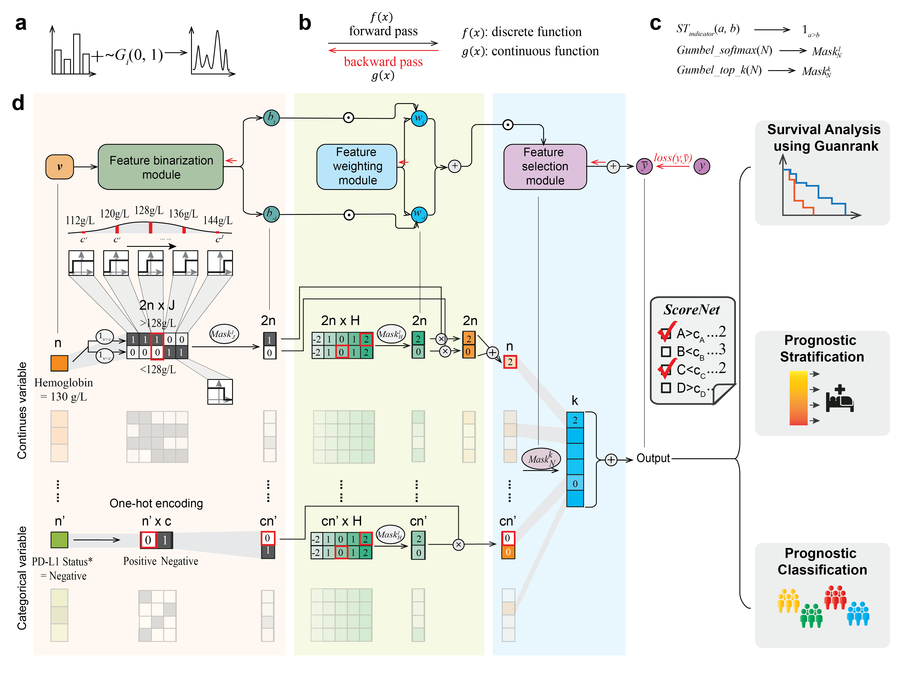

# ScoreNet Population Simulation of Survival Risk Prediction

## Overview

ScoreNet is an interpretable, end-to-end neural network that learns a sparse, additive integer scoring system for survival risk prediction. Instead of producing an opaque continuous predictor, it selects a small set of features, discretizes them at learned cutoffs, and assigns integer weights, yielding a transparent rule table that clinicians can read and apply directly.

This repository provides a fully specified **synthetic survival experiment** that makes the ScoreNet training procedure transparent and reproducible. It documents how the model is optimized with a pairwise margin-ranking loss, how the best deterministic scoring system is selected on validation data, and how it compares with a Cox proportional hazards (Cox PH) baseline under a known data-generating process. The simulation is illustrative only and was not used to derive or tune any clinical scoring system.

## Directory Structure

* `assets/`.
* `code/`: Contains the executable Python scripts and logic. 
  * *Main Experiment Script:* `main_fun.py`
* `data/`
* `environment/`: Contains package dependencies (e.g., `requirements.txt`).
* `results/`: Output directory where scripts should save their output files.

---

## ScoreNet Structure

---

## Methods

### Data and inputs
Each synthetic run generates 1,500 patients with a 30% held-out test split; the remainder is split into training and validation (event-stratified). The simulator includes 100 raw features but only 10 informative source variables (plus correlated proxies), with event times drawn from a proportional hazards model. Continuous features are binned at training-set quantiles and categoricals are one-hot encoded. Survival time and status are converted into GuanRank targets $g_i \in [0,1]$ (higher = worse prognosis), used only for rank-based training; discrimination is reported with the C-index.

### Margin-ranking loss
ScoreNet is trained with a pairwise `MarginRankingLoss` rather than a regression loss. Patients are randomly paired within each mini-batch, and the model is rewarded for assigning the higher score to the worse-prognosis patient by at least a fixed margin. This is well suited to ScoreNet because its output is a discrete additive risk score meant to *order* patients into strata — only the relative ranking is clinically meaningful, not the absolute GuanRank value. The margin encourages clean separation and avoids rewarding negligible score differences, while remaining robust to scaling and quantization mismatch that would hurt an MSE objective.

### Optimization and model selection
Discrete choices (feature cutoffs, integer coefficients, feature selection, and intercept) are made differentiable via Gumbel-Softmax / Gumbel top-k relaxations with an annealed temperature, optimized using Adam with gradient clipping. At each validation step the stochastic network is collapsed into a deterministic rule table (modal cutoffs, weights, selection mask, and intercept), and the checkpoint with the highest validation C-index is kept. A Cox PH model trained on the same splits and features (ridge-penalty search) serves as the baseline.

### Evaluation and feature budgeting
The **feature budget** acts as both capacity and regularization: a budget near the true signal dimension (~10) is appropriate, while a larger budget tends to absorb proxies and noise and can degrade held-out performance. The **standard C-index** is the primary, conservative metric for comparison with the near-continuous Cox PH predictor. A supplementary **tied-out C-index** is also reported: because ScoreNet intentionally maps patients to a limited set of integer scores, many pairs tie, and the tied-out metric shows that the pairs the scorecard *does* separate are ordered with high accuracy. Across sensitivity scenarios ScoreNet performs comparably to Cox PH in baseline settings, less favorably under highly correlated proxies, and better in high-dimensional (300-feature) settings — consistent with its role as a sparse, interpretable rule-table learner.

## Citation

Ruihao Huang, Hao Zhu, Yue Huang et al. Development of A Scoring System via An Interpretable End-to-end Neural Network for Prognostic Stratification of Patients with Advanced Melanoma, 18 December 2025, PREPRINT (Version 1) available at Research Square [https://doi.org/10.21203/rs.3.rs-8118762/v1]